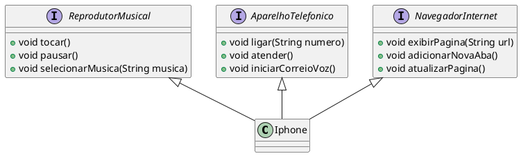

# Funcionalidades iPhone - Desafio POO

O objetivo do desafio é modelar e diagramar a representação do iPhone com base no [vídeo de lançamento do dispositivo](https://www.youtube.com/watch?v=9ou608QQRq8).

## Diagrama de classes
